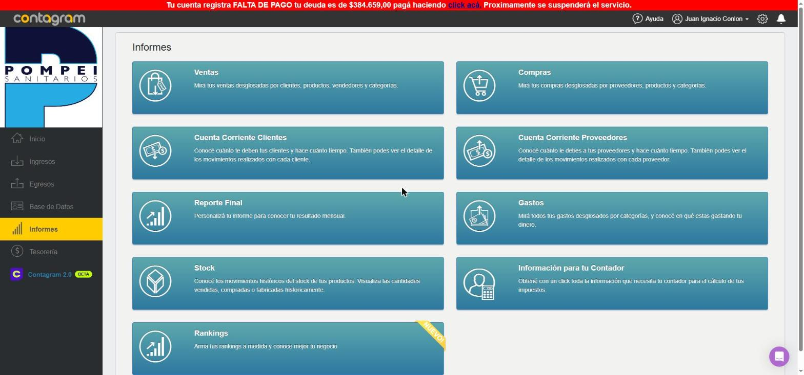
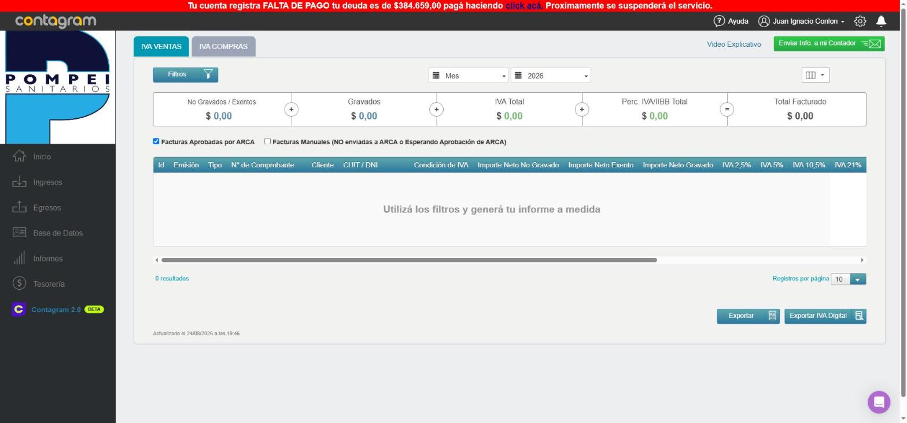
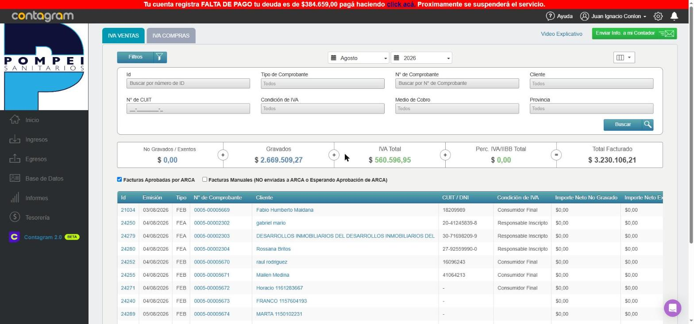
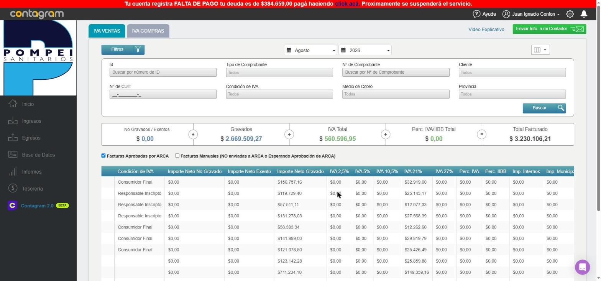
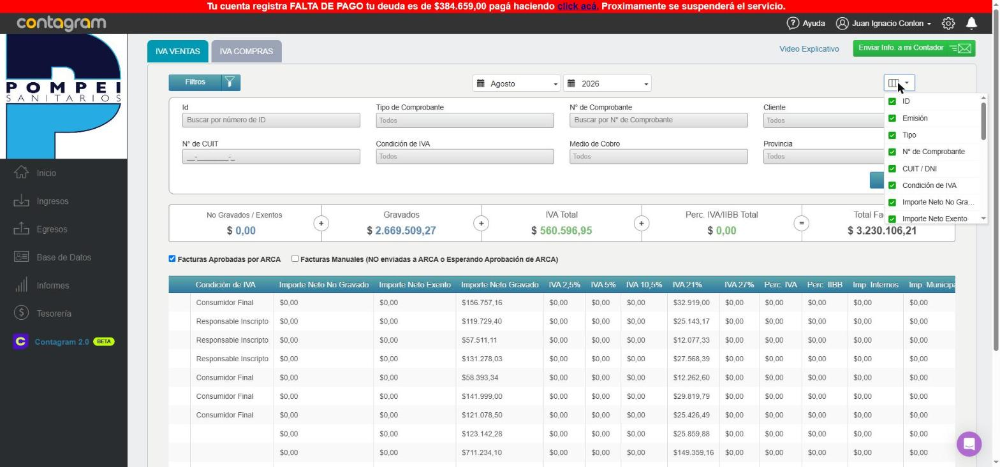
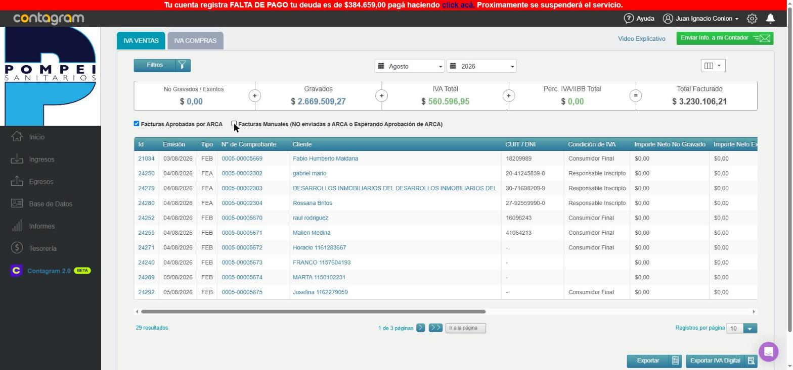
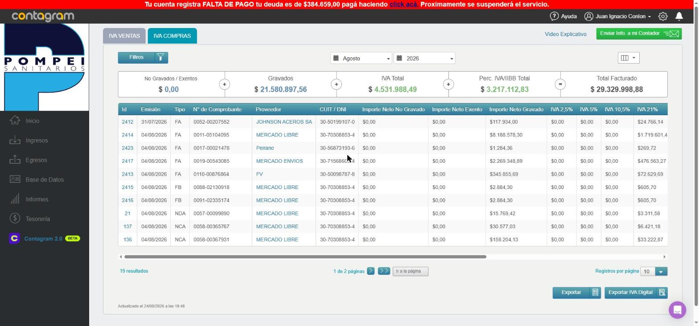

# Informe: Funcionalidad de "Información para tu Contador" en Contagram

**Cuenta explorada:** Pompei Sanitarios (cuenta real del cliente, usuario "Juan Ignacio Conlon").
**URL analizada:** `https://app.contagram.com/accountant_reports`
**Fecha de la exploración:** 24/08/2026.
**Modalidad:** Exploración **estrictamente de solo lectura**. No se creó, editó ni eliminó ningún registro, no se enviaron formularios, no se descargó ningún archivo y no se activó ninguna acción con efecto (no se tocó "Enviar Info. a mi Contador", "Exportar", "Exportar IVA Digital" ni el aviso de deuda/pago). Únicamente se navegó, se usaron filtros de búsqueda (que no modifican datos) y se sacaron capturas de pantalla.

## Ubicación dentro de la app

Esta pantalla corresponde a la tarjeta **"Información para tu Contador"** dentro del hub general de **Informes** (`/reports`), junto a otros informes disponibles en la cuenta: Ventas, Compras, Cuenta Corriente Clientes, Cuenta Corriente Proveedores, Reporte Final, Gastos, Stock y Rankings (este último marcado como "NUEVO").

La descripción de la tarjeta indica su propósito: *"Obtené con un click toda la información que necesita tu contador para el cálculo de tus impuestos."*

## Estructura de la pantalla `accountant_reports`

La pantalla tiene **dos pestañas**:

- **IVA VENTAS** (pestaña por defecto)
- **IVA COMPRAS**

Ambas comparten la misma estructura: un Libro IVA (Ventas / Compras) armado automáticamente a partir de los comprobantes cargados en el sistema, pensado para que el contador pueda calcular el IVA del período.

### Estado inicial (sin filtro de período seleccionado)

Al entrar, el período (mes/año) viene sin seleccionar y la tabla aparece vacía con el mensaje **"Utilizá los filtros y generá tu informe a medida"** — es decir, el informe no se precarga solo, hay que elegir explícitamente el mes.

### Selector de período

Hay dos combos: **Mes** (Enero a Diciembre) y **Año** (2026 en este caso). Al elegir un mes (probé "Agosto"), el sistema muestra un cartel de carga *"Estamos preparando tu informe..."* y luego trae los resultados de ese mes.

### IVA Ventas — con datos reales (Agosto 2026)

Con el período seleccionado, se completan:

- **Barra de totales**: No Gravados/Exentos, Gravados, IVA Total, Perc. IVA/IIBB Total, y Total Facturado (suma de todo). Para agosto 2026: Gravados $2.669.509,27 / IVA Total $560.596,95 / Total Facturado $3.230.106,21.
- **Tabla de comprobantes**, uno por fila, con: Id, Emisión, Tipo (FEA, FEB, etc.), N° de Comprobante, Cliente, CUIT/DNI, Condición de IVA (Consumidor Final, Responsable Inscripto), y luego los importes desglosados.

Desplazando la tabla hacia la derecha aparecen más columnas de desglose impositivo: Importe Neto No Gravado, Importe Neto Exento, Importe Neto Gravado, IVA 2,5% / 5% / 10,5% / 21% / 27%, Percepción IVA, Percepción IIBB, Impuestos Internos, Impuestos Municipales — es decir, el detalle completo por alícuota que normalmente pide un contador para el Libro IVA Digital.

### Selector de columnas visibles

El ícono de columnas (arriba a la derecha de la tabla) abre un listado con checkbox por cada columna (ID, Emisión, Tipo, N° de Comprobante, CUIT/DNI, Condición de IVA, Importe Neto No Gravado, Importe Neto Exento, etc.), permitiendo mostrar/ocultar columnas según lo que el usuario necesite ver. No se modificó ninguna selección, solo se abrió el panel para documentarlo.

### Filtros disponibles

El botón **"Filtros"** despliega un panel de búsqueda con: Id, Tipo de Comprobante, N° de Comprobante, Cliente, N° de CUIT, Condición de IVA, Medio de Cobro y Provincia, más un botón "Buscar". Permite acotar el informe a un comprobante, cliente o condición de IVA específicos dentro del período elegido.

### Distinción "Facturas Aprobadas por ARCA" vs "Facturas Manuales"

Debajo de la barra de totales hay dos checkboxes:

- **Facturas Aprobadas por ARCA** (tildado por defecto): son los comprobantes electrónicos ya validados por ARCA (ex AFIP).
- **Facturas Manuales (NO enviadas a ARCA o Esperando Aprobación de ARCA)**: comprobantes cargados manualmente en el sistema que todavía no tienen validación fiscal. Esto es clave para el contador, porque le permite distinguir qué está firme fiscalmente y qué todavía está pendiente/es informal.

### Paginación y exportación

Al pie de la tabla: cantidad de resultados (29 para IVA Ventas de agosto, 19 para IVA Compras), navegación por páginas ("1 de 3 páginas" con flechas e "Ir a la página"), selector de "Registros por página", y fecha/hora de última actualización del informe.

También hay dos botones de exportación — **Exportar** y **Exportar IVA Digital** — que no se activaron durante esta exploración (habría generado una descarga real). El segundo, por el nombre, sugiere que genera el archivo en el formato que exige el "Libro IVA Digital" de ARCA.

### IVA Compras — con datos reales (Agosto 2026)

La pestaña "IVA Compras" replica exactamente la misma lógica que IVA Ventas, mostrando en este caso proveedores en vez de clientes: Id, Emisión, Tipo (FA, FB, NDA/NCA — notas de débito/crédito de compra), N° de Comprobante, Proveedor, CUIT/DNI, y el mismo desglose de importes netos e IVA por alícuota. Para agosto 2026: Gravados $21.580.897,56 / IVA Total $4.531.988,49 / Total Facturado $29.329.998,88 (19 resultados, 2 páginas).

### Otras funcionalidades visibles en pantalla (no accionadas)

- **"Enviar Info. a mi Contador"** (botón verde arriba a la derecha): por el nombre, dispararía el envío del informe (probablemente por email) directamente al contador de la cuenta. No se activó.
- **"Video Explicativo"** (link celeste): probablemente abre un tutorial en video sobre cómo usar esta sección. No se abrió.
- **Aviso rojo de deuda** en la parte superior ("Tu cuenta registra FALTA DE PAGO... pagá haciendo click acá"): es un aviso de facturación de la propia suscripción a Contagram, no relacionado al informe. No se interactuó con él.

## Resumen de funcionalidades detectadas

1. Dos libros IVA completos (Ventas y Compras), armados automáticamente a partir de la facturación real cargada en el sistema, filtrables por mes/año.
2. Desglose por alícuota de IVA (2,5% / 5% / 10,5% / 21% / 27%), percepciones de IVA/IIBB, impuestos internos y municipales — el nivel de detalle que pide una liquidación de impuestos.
3. Filtros de búsqueda por comprobante, cliente/proveedor, CUIT, condición de IVA, medio de cobro y provincia.
4. Selector de columnas visibles, personalizable.
5. Separación explícita entre comprobantes ya validados por ARCA y comprobantes manuales/pendientes de validación.
6. Exportación a archivo (genérica) y una exportación específica "IVA Digital" (no probadas, para no generar descargas).
7. Envío directo del informe al contador de la cuenta con un botón dedicado (no probado, para no disparar un envío real).

## Nota

No se navegó fuera de esta sección más allá de confirmar, desde el hub de Informes, que "Información para tu Contador" es efectivamente esta misma pantalla (`/accountant_reports`). No se abrió el detalle de ningún comprobante individual ni se interactuó con datos de clientes/proveedores particulares, siguiendo el pedido de máxima precaución al tratarse de la cuenta real del cliente.
