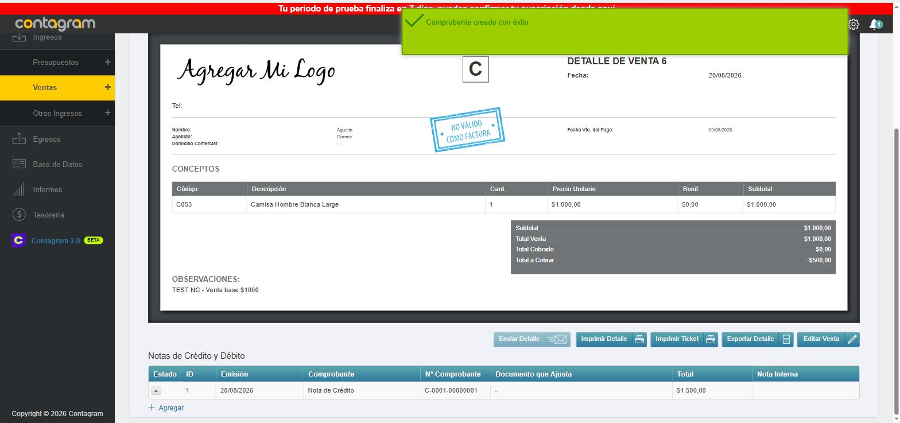
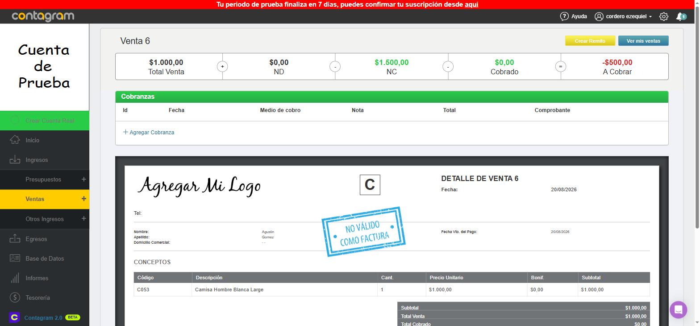
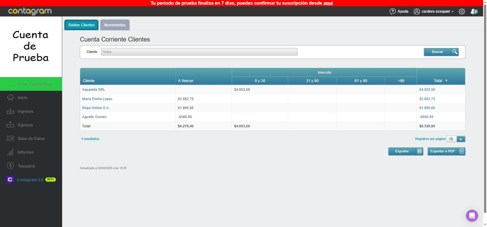
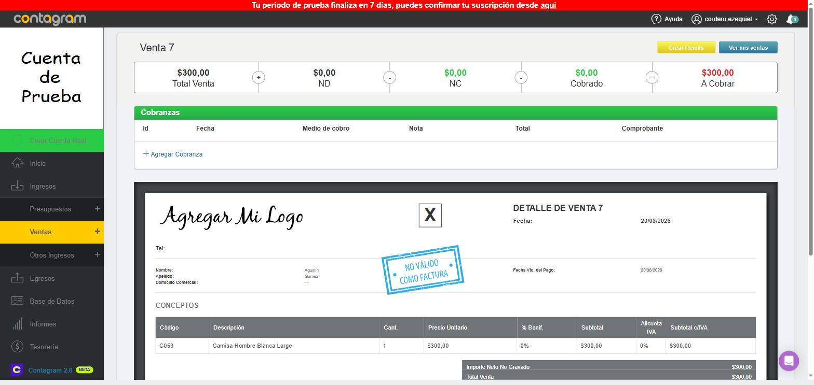
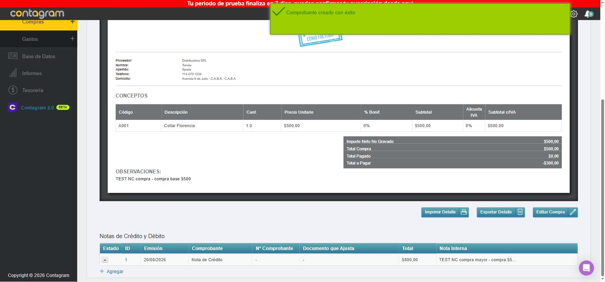

# Informe: Notas de Crédito/Débito mayores al monto original en Contagram

**Entorno:** Cuenta demo de Contagram (`app.contagram.com`), usuario `cordero ezequiel`.
**Fecha de la prueba:** 20/08/2026.
**Objetivo:** Verificar qué sucede cuando se crea una Nota de Crédito (NC) por un monto **mayor** al de la venta o compra original: si el sistema la bloquea, la topea, o genera un saldo a favor, y si ese saldo puede aplicarse luego a otra operación.

## Resumen ejecutivo

- Contagram **permite** crear una NC por un monto mayor al de la venta/compra que ajusta. No hay validación que la bloquee ni que la limite al monto original.
- El excedente **sí queda registrado como saldo a favor** del cliente (o a favor propio, en el caso de una compra a un proveedor), tanto en el documento afectado como en los reportes de Cuenta Corriente.
- Ese saldo a favor **se refleja correctamente en los totales acumulados** de la cuenta corriente del cliente/proveedor (reduce lo que se le debe / le debemos en conjunto).
- Sin embargo, **no encontré ningún mecanismo explícito en la interfaz para "aplicar" o asignar ese saldo a una venta o compra puntual nueva**. Cada documento nuevo mantiene su propio "A Cobrar"/"A Pagar" de forma independiente hasta que se cobra/paga con un medio de pago real; el saldo a favor no aparece como opción dentro de "Medio de Cobro" ni pude hacer funcionar el selector "Documento que Ajusta" al crear la NC para vincularla a otra operación.

A continuación el detalle de las pruebas, con capturas.

## Prueba 1 — Ventas

1. Se creó **Venta 6** para el cliente Agustín Gómez por **$1.000,00** (comprobante tipo C, para poder emitir NC).
2. Se generó una **Nota de Crédito** sobre esa venta por **$1.500,00** (mayor al monto original).
3. Resultado en el documento de la Venta 6:
   - Total Venta: $1.000,00
   - NC: $1.500,00
   - Cobrado: $0,00
   - **A Cobrar: -$500,00** (negativo, sin ningún bloqueo ni advertencia de error)
   - El estado de la venta pasó a mostrarse como **"Cobrado"** (verde) en el listado, a pesar de estar sobre-acreditada — una posible fuente de confusión, ya que ese estado normalmente indica "cobrada en su totalidad", no "con saldo a favor".

   
   

4. En **Cuenta Corriente Clientes** (`Saldos Clientes`), el cliente Agustín Gómez pasó a figurar con un **Total de -$500,00**, es decir, saldo a favor reconocido a nivel cuenta corriente.

   

5. Al ir a crear una **nueva venta** para el mismo cliente, el selector de clientes ya muestra el saldo junto al nombre: `Agustin Gomez  $-500,00`.

6. Se creó una segunda venta de prueba, **Venta 7**, por **$300,00**, para probar si el saldo se aplicaba automáticamente:
   - La Venta 7, vista de forma individual, **no absorbió el crédito**: quedó con estado "A Cobrar" (amarillo) y "A Cobrar: $300,00", como si el cliente no tuviera saldo a favor.
   - En el reporte de **Movimientos** (cuenta corriente), la columna "A Cobrar" de esa fila mostró **-$200,00**, pero esto corresponde al **saldo acumulado/corrido** de la cuenta (-$500 + $300), no a una aplicación específica del crédito a esa venta.
   - En **Saldos Clientes**, el total de Agustín Gómez pasó de -$500,00 a **-$200,00**, reflejando correctamente el neto acumulado.

   

7. Intenté buscar una forma explícita de "usar" ese saldo a favor sobre la Venta 7:
   - En el modal "Nuevo Cobro" (Agregar Cobranza), el desplegable "Elija Medio de Cobro" solo ofrece cuentas de caja/banco/tarjetas (Efectivo, Bancos, Mercado Pago, tarjetas, cheques, etc.) — **no hay opción de "saldo a favor" ni de "Notas de Crédito disponibles"**.
   - En el asistente para crear una NC/ND, el campo "Documento que Ajusta" nunca se pobló con opciones seleccionables en mis pruebas (siempre quedó solo con el placeholder "Seleccionar Comprobante"), incluso forzando eventos de cambio por consola. No pude usarlo para vincular el crédito sobrante a la Venta 7.
   - Tampoco encontré, desde el listado de Movimientos ni desde la ficha del cliente, una acción del tipo "Aplicar a otra venta" o "Compensar".

## Prueba 2 — Compras (mismo comportamiento)

Se repitió la prueba del lado de compras para confirmar simetría:

1. Se creó **Compra 6** al proveedor Distribuidora SRL por **$500,00**.
2. Se generó una **Nota de Crédito** de compra por **$800,00** (mayor al monto original).
3. Resultado:
   - Total Compra: $500,00
   - NC: $800,00
   - Pagado: $0,00
   - **A Pagar: -$300,00** (negativo, sin bloqueo)

   

4. En **Cuenta Corriente Proveedores**, Distribuidora SRL pasó a figurar con **Total -$300,00**, es decir, saldo a favor nuestro reconocido igual que en ventas.

El comportamiento es exactamente análogo al de ventas: se permite, no se topea, y el saldo queda reflejado como crédito en la cuenta corriente del proveedor, pero sin una función visible para asignarlo a una compra puntual futura.

## Conclusiones

1. **¿Se puede cargar una NC mayor al monto original?** Sí, sin restricciones. No hay validación de monto máximo ni mensaje de error.
2. **¿Queda como saldo a favor?** Sí, tanto en el documento individual (columna "A Cobrar"/"A Pagar" en negativo) como en los reportes de Cuenta Corriente Clientes/Proveedores (columna Total en negativo), y se ve reflejado al seleccionar el cliente/proveedor en una operación nueva.
3. **¿Se puede aplicar automáticamente a otras ventas/compras?** Aquí hay una diferencia frente a lo esperado: **el saldo NO se aplica ni se descuenta automáticamente del "A Cobrar"/"A Pagar" de un documento nuevo específico**. Lo que sí ocurre es que el **saldo consolidado de la cuenta corriente del cliente/proveedor se actualiza correctamente de forma acumulativa** (suma y resta todos los movimientos), por lo que en términos contables generales el crédito "está ahí" y reduce lo adeudado en conjunto — pero no hay, dentro de la interfaz explorada, un botón o flujo tipo "aplicar saldo a favor a esta venta" que dispare una asignación formal documento-a-documento.

## Observaciones / posibles puntos a revisar con Contagram

- El estado "Cobrado" que se le asigna automáticamente a una venta sobre-acreditada (Venta 6, con -$500 de saldo) puede ser confuso para quien mira solo el listado de ventas, ya que no distingue "cobrado exacto" de "cobrado de más / con saldo a favor".
- El campo "Documento que Ajusta" del asistente de Notas de Crédito/Débito parece pensado para vincular la nota a otro comprobante pendiente, pero en la cuenta demo nunca se pobló con opciones seleccionables; vale la pena confirmar con soporte de Contagram si es una limitación de la cuenta de prueba, un permiso faltante, o si la aplicación del saldo a favor se resuelve por otra vía (por ejemplo, un asiento manual de tesorería o el módulo "Contagram 2.0" en beta, que no llegué a explorar en profundidad).
- Si necesitan aplicar en la práctica un saldo a favor grande a compras/ventas futuras, por ahora conviene hacerlo con seguimiento manual (dejar constancia en la nota interna de qué venta "consume" el crédito) y validar el neto final contra el reporte de Cuenta Corriente, ya que el sistema no deja un rastro automático de esa asignación.

---
*Registros de prueba creados en la cuenta demo (pueden eliminarse sin afectar datos reales): Venta 6, Venta 7, Nota de Crédito #1 (ventas), Compra 6, Nota de Crédito #1 (compras).*
